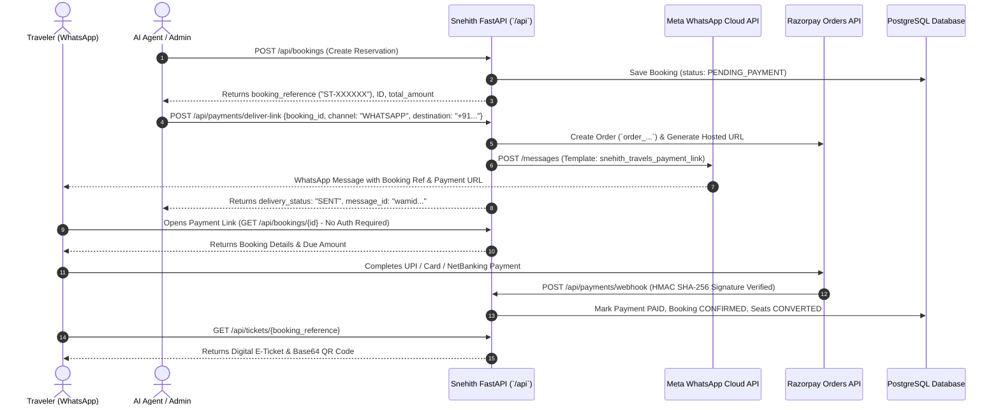

# Snehith Travels — AI Agent & Developer Integration Guide
**System Version:** Production 1.2.0  
**Live Endpoint:** `https://opsfusionn.online`  
**Swagger Interactive Docs:** `https://opsfusionn.online/docs`  
**OpenAPI Specification:** `https://opsfusionn.online/openapi.json`

---

## 1. Executive Summary & Purpose

This document provides external AI agents (e.g., Saarthi Voice AI, WhatsApp chatbots, autonomous booking agents) and backend engineers with a comprehensive technical specification of the Snehith Travels booking, payment, and WhatsApp dispatch workflows.

### Key Capabilities Built:
1. **Official Meta WhatsApp Cloud API Integration**: Automated outbound payment link and booking notification delivery to Indian mobile numbers via Meta Graph API `v22.0`.
2. **Public / Unauthenticated Payment Flow**: Customers opening a WhatsApp payment link do **not** need to log in or create an account; payments and e-ticket generation are completely public and accessible via unique booking references and IDs.
3. **Razorpay Standard Orders Architecture**: Fixed the Razorpay 30-link test cap by transitioning to Razorpay Orders (`order_...`) and standard on-page checkout modals (`checkout.razorpay.com/v1/checkout.js`), eliminating all broken redirect pages.

---

## 2. System Architecture & Flow Diagram



---

## 3. Meta WhatsApp Cloud API Integration

### 3.1 Overview & Why Twilio Was Removed
* **Previous Limitation**: Twilio free/sandbox accounts required users to manually opt-in by sending `join <code-word>` to a US phone number (`+1 737...`), causing messages to fail for normal customers.
* **Current Implementation**: Direct integration with **Meta WhatsApp Cloud API (Graph API `v22.0`)** via Facebook's global infrastructure.

### 3.2 The 24-Hour Customer Window & Template Messaging Rule
> [!IMPORTANT]
> Meta WhatsApp Cloud API enforces a strict policy for business-initiated conversations:
> - **Free-form text (`type: "text"`)**: Allowed **only** if the customer messaged the business within the previous 24 hours. Outside that window, free-form text is silently dropped by Meta's network.
> - **Pre-approved Template (`type: "template"`)**: **Required** for all outbound business notifications (payment links, order confirmations, tickets). Delivered reliably to any valid WhatsApp number.

### 3.3 Active Template Specification
* **Template Name**: `snehith_travels_payment_link` (or the value of `WHATSAPP_PAYMENT_TEMPLATE_NAME`)
* **Language**: `en` (`English`, matching the approved template in Meta Developer Console)
* **Parameters**:
  1. `{{1}}` (*Text*): Customer / Passenger Name (defaults to passenger name or `"Customer"`).
  2. `{{2}}` (*Text*): Booking Reference (e.g. `"ST-YW3RJR"`).
  3. `{{3}}` (*Text*): Fare and Payment URL (e.g. `"Amount: Rs 499 | Pay: https://opsfusionn.online/payment?booking_id=37"`).
* **Suggested body**: `Hello {{1}} Greetings from the Snehith Travels,\n\nYour Snehith Travels booking {{2}} is awaiting payment.\n\nFare and secure payment link: {{3}}\n\nPlease complete payment to confirm your seat.`
* **No generic fallback**: A failed template send is reported as failed, rather than sending an unrelated greeting or retail message.

### 3.4 Phone Number Normalization
* **Indian Mobile Format**: All numbers are sanitized to 10 digits starting with `6`, `7`, `8`, or `9`.
* **Standard E.164 Prefix**: Meta expects numbers formatted with the country code without `+` (e.g. `918712145983`). The backend automatically parses inputs starting with `+91`, `91`, `0`, or raw 10 digits.

---

## 4. Public / Unauthenticated Payment Flow

> [!TIP]
> External AI agents can send the payment link to any user, family member, or client without forcing them to register or remember passwords.

### Security & Access Control Model:
* **Booking Creation (`POST /api/bookings`)**: Protected by JWT (`get_current_user`) — ensures the AI agent, admin, or user is identified when creating seats.
* **Booking Lookup (`GET /api/bookings/{id_or_ref}`)**: **Publicly accessible**. Anyone possessing the numeric `booking_id` or unique reference code (`ST-XXXXXX`) can view the journey details and fare due.
* **Payment Link Generation (`POST /api/payments`)**: **Publicly accessible**. Backend calculates the exact amount from the database booking record (client-supplied amount is ignored to prevent tampering).
* **Payment Status Verification (`GET /api/payments/{id}`)**: **Publicly accessible**. Returns authoritative status (`PENDING`, `PAID`, `FAILED`, `CANCELLED`).
* **Digital Ticket & QR Code (`GET /api/tickets/{id_or_ref}`)**: **Publicly accessible**. Allows passengers, conductors, and agents to scan or view verified boarding passes without logging in.

---

## 5. API Reference for AI Agents

### 5.1 Deliver Payment Link via WhatsApp
Dispatches a secure payment link directly to the passenger's WhatsApp number.

* **Method**: `POST`
* **Endpoint**: `/api/payments/deliver-link`
* **Authentication**: Not required (can be called by frontend, AI agent, or admin).

#### Request Body (`application/json`):
```json
{
  "booking_id": 37,
  "channel": "WHATSAPP",
  "destination": "+918712145983"
}
```
*Alternative:* Can pass `"payment_id"` instead of `"booking_id"`.

#### Response Body (`200 OK`):
```json
{
  "delivery_status": "SENT",
  "channel": "WHATSAPP",
  "destination": "918712145983",
  "payment_url": "https://opsfusionn.online/payment?booking_id=37",
  "booking_reference": "ST-YW3RJR",
  "amount": 499.0,
  "message_id": "wamid.HBgMOTE4NzEyMTQ1OTgzFQIAERgSOTJFREI5MUMzNDk5RTVERjVDAA==",
  "message": "Payment link successfully dispatched via Meta WhatsApp template to 918712145983 (Message ID: wamid.HBgMOTE4NzEyMTQ1OTgzFQIAERgSOTJFREI5MUMzNDk5RTVERjVDAA==)."
}
```

---

### 5.2 Get Booking Details (Unauthenticated)
Retrieve booking summary, route, seats, and fare.

* **Method**: `GET`
* **Endpoint**: `/api/bookings/{booking_id_or_ref}`
* **Example**: `GET https://opsfusionn.online/api/bookings/37` or `GET https://opsfusionn.online/api/bookings/ST-YW3RJR`

#### Response Body (`200 OK`):
```json
{
  "id": 37,
  "booking_reference": "ST-YW3RJR",
  "user_id": 1,
  "bus_id": 2,
  "journey_date": "2026-09-19",
  "boarding_point": "KPHB (06:45)",
  "dropping_point": "Bhavanipuram (12:30)",
  "total_amount": 499.0,
  "status": "CONFIRMED",
  "created_at": "2026-09-18T07:01:08.196433",
  "seat_numbers": ["S24"],
  "bus_name": "Snehith Express AC Seater",
  "operator": "Snehith Travels",
  "bus_type": "AC Seater",
  "origin": "Hyderabad",
  "destination": "Vijayawada",
  "departure_time": "07:15",
  "arrival_time": "12:45",
  "passengers": [
    {
      "id": 70,
      "seat_id": 56,
      "seat_number": "S24",
      "name": "Snehith Admin",
      "age": 28,
      "gender": "M"
    }
  ],
  "payment_status": "PAID",
  "payment_id": 31
}
```

---

### 5.3 Initiate Payment Record & Razorpay Order (Unauthenticated)
Creates or retrieves the active Razorpay Order and payment URL.

* **Method**: `POST`
* **Endpoint**: `/api/payments`
* **Request Body**:
```json
{
  "booking_id": 37,
  "payment_method": "RAZORPAY_PAYMENT_LINK"
}
```

#### Response Body (`201 Created` or `200 OK`):
```json
{
  "id": 31,
  "payment_id": 31,
  "booking_id": 37,
  "booking_reference": "ST-YW3RJR",
  "amount": 499.0,
  "currency": "INR",
  "payment_url": "https://opsfusionn.online/payment?booking_id=37",
  "provider": "razorpay",
  "provider_payment_link_id": "order_TdPTEDA4lpd0pf",
  "status": "PENDING",
  "created_at": "2026-09-18T07:01:15.177723"
}
```

---

### 5.4 Instant Sandbox Pay (Testing / AI Agent Simulation)
Simulates instant payment completion without manual card/UPI entry during agent testing.

* **Method**: `POST`
* **Endpoint**: `/api/payments/{payment_id}/mock-success`
* **Response Body (`200 OK`):**
```json
{
  "status": "PAID",
  "message": "Payment marked as successful via sandbox simulation.",
  "booking_reference": "ST-YW3RJR",
  "booking_status": "CONFIRMED"
}
```

---

### 5.5 Retrieve Digital Ticket & QR Code (Unauthenticated)
Returns verified digital ticket with dynamic QR code PNG encoded as a Base64 data URI.

* **Method**: `GET`
* **Endpoint**: `/api/tickets/{booking_id_or_ref}`
* **Example**: `GET https://opsfusionn.online/api/tickets/ST-YW3RJR`

#### Response Body (`200 OK`):
```json
{
  "booking_reference": "ST-YW3RJR",
  "booking_id": 37,
  "status": "CONFIRMED",
  "bus_name": "Snehith Express AC Seater",
  "operator": "Snehith Travels",
  "origin": "Hyderabad",
  "destination": "Vijayawada",
  "journey_date": "2026-09-19",
  "departure_time": "07:15",
  "arrival_time": "12:45",
  "duration": "5h 30m",
  "boarding_point": "KPHB (06:45)",
  "passengers": [
    {
      "name": "Snehith Admin",
      "age": 28,
      "gender": "M",
      "seat_number": "S24"
    }
  ],
  "seats": ["S24"],
  "total_amount": 499.0,
  "qr_code": "data:image/png;base64,iVBORw0KGgoAAAANSUhEUgAAAOgAAADo...",
  "qr_content": "SNEHITH_TRAVELS_TICKET:ST-YW3RJR"
}
```

---

## 6. Complete AI Agent Workflow (End-to-End)

When building an autonomous voice or text AI agent for Snehith Travels, implement this sequence:

```python
import httpx

BASE_URL = "https://opsfusionn.online"

# Step 1: Agent searches buses
buses = httpx.get(f"{BASE_URL}/api/buses/search", params={
    "from": "Hyderabad",
    "to": "Vijayawada",
    "journey_date": "2026-09-19",
    "passengers": 1,
    "sort_by": "cheapest"
}).json()
selected_bus = buses[0]

# Step 2: Agent holds seats and books ticket on behalf of traveler
# (Using agent auth token)
headers = {"Authorization": f"Bearer {AGENT_TOKEN}"}
booking_payload = {
    "bus_id": selected_bus["bus_id"],
    "journey_date": "2026-09-19",
    "boarding_point": selected_bus["boarding_points"][0],
    "dropping_point": selected_bus["dropping_points"][0],
    "passengers": [
        {"name": "Traveler Name", "age": 26, "gender": "M", "seat_number": "S24"}
    ]
}
booking = httpx.post(f"{BASE_URL}/api/bookings", headers=headers, json=booking_payload).json()
booking_id = booking["id"]
booking_ref = booking["booking_reference"]

# Step 3: Agent dispatches payment link via Meta WhatsApp Cloud API
delivery = httpx.post(f"{BASE_URL}/api/payments/deliver-link", json={
    "booking_id": booking_id,
    "channel": "WHATSAPP",
    "destination": "+918712145983"
}).json()
print("WhatsApp Message Dispatched! Meta ID:", delivery["message_id"])

# Step 4: Passenger receives WhatsApp template and pays at:
# https://opsfusionn.online/payment?booking_id={booking_id}
# (No login required by the passenger)

# Step 5: Agent checks payment confirmation
status_info = httpx.get(f"{BASE_URL}/api/bookings/{booking_ref}").json()
if status_info["status"] == "CONFIRMED":
    # Step 6: Fetch verified QR Code E-Ticket
    ticket = httpx.get(f"{BASE_URL}/api/tickets/{booking_ref}").json()
    print("Ticket Confirmed! Boarding Pass QR:", ticket["qr_code"][:50], "...")
```

---

## 7. Production Environment Configuration

The following configuration is active on the AWS EC2 instance (`13.235.83.114`):

| Variable Name | Environment Scope | Description |
|---|---|---|
| `FRONTEND_URL` | Backend Container | `https://opsfusionn.online` |
| `WHATSAPP_PHONE_NUMBER_ID` | Backend Container | `1341186229071206` (Meta WhatsApp Test/Production Phone ID) |
| `WHATSAPP_API_TOKEN` | Backend Container | Meta Graph API System User Bearer Token |
| `WHATSAPP_API_VERSION` | Backend Container | `v22.0` |
| `RAZORPAY_KEY_ID` | Backend & Frontend | `rzp_test_Tcz7Z70RAqZvXw` |
| `RAZORPAY_KEY_SECRET` | Backend Container | Razorpay Test Key Secret |
| `NEXT_PUBLIC_RAZORPAY_KEY_ID`| Frontend Container | Built into Next.js client bundle |
| `POSTGRES_DB` | Postgres Container | `snehith_travels` (persistent Docker volume) |

---

## 8. Summary for AI Voice Agents & LLMs
When interacting with customers:
1. "I have booked your seat on Snehith Express! Your booking reference is **ST-XXXXXX**."
2. "I have sent the official WhatsApp payment link to your number **+91XXXXXXXXXX**."
3. "You do not need to create an account or log in. Simply click the link in your WhatsApp, pay securely with UPI or Card, and your ticket with QR code will be generated instantly."
